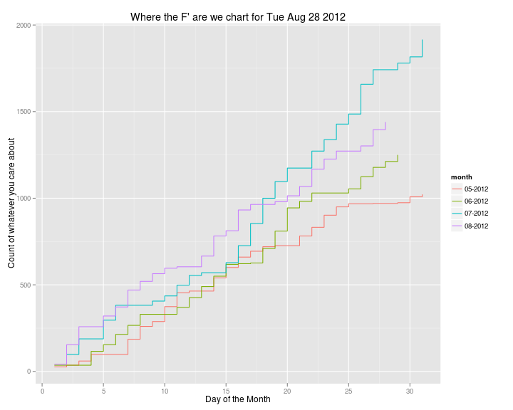

Monthly Sales Chart
========================================================

An example in R and Python/d3.js
-------------------------------------

A particularly favorite question of the ze suits is 'Where are we relative to last month?' An interesting metric companies use is month over month sales report. We are we compared to last month or last year. Now with some industries month's end is an arbitrary segmentation, in that case a trailing 30/60/90 days makes more sense, but if this makes sense this type of chart can be useful.

In Part One, We are going to first review two purely R/ggplot way of generating this data and then in Part 2 we are going to use the python library Pandas and the excellent JavaScript d3.js library. I hope this is a useful comparison of the languages.
s

First lets look at the data. These can be any date stamped transaction you are interested comparing across months. First lets load the data, avoiding the mess of factors


```r
RawData <- read.table(file = "~/rtutorials/MonthlyStepGraph/data.txt", 
    stringsAsFactors = FALSE, header = TRUE)  #load from flat file, do not create factors
head(RawData)  #get the first five row
```

```
##        dates
## 1 2012-05-07
## 2 2012-06-19
## 3 2012-05-07
## 4 2012-07-03
## 5 2012-05-07
## 6 2012-05-07
```

```r
dim(RawData)  #get the dimentions
```

```
## [1] 5628    1
```


So all we have is a long list of dates, say these are sales or signups. We can get a simple count of frequency with the table() function.


```r
counts <- as.data.frame(table(RawData))  # get counts by date, then back to a data.frame
head(counts)
```

```
##      RawData Freq
## 1 2012-05-01   26
## 2 2012-05-02   10
## 3 2012-05-03   24
## 4 2012-05-04   38
## 5 2012-05-07   88
## 6 2012-05-08   74
```


From here we can extract the date info we need to plot a chart.


```r
counts["month"] <- format.Date(counts[, 1], "%m-%Y")
counts["day"] <- as.integer(format.Date(counts[, 1], "%d"))
head(counts)
```

```
##      RawData Freq   month day
## 1 2012-05-01   26 05-2012   1
## 2 2012-05-02   10 05-2012   2
## 3 2012-05-03   24 05-2012   3
## 4 2012-05-04   38 05-2012   4
## 5 2012-05-07   88 05-2012   7
## 6 2012-05-08   74 05-2012   8
```


What we want is the cumulative sum of the transactions for each months. First I will present the base approach to this, which is a common and useful pattern in R.


```r
month.list <- unique(counts$month)  #Get a vector of the groups you care about
month.list
```

```
## [1] "05-2012" "06-2012" "07-2012" "08-2012"
```

```r
# create a simple function that will calculate what you want for each
# group (the cumulative sum for each month in our case)
cumSumByMonth <- function(month) {
    data.frame(name = month, day = counts[which(counts$month == month), 4], 
        cumsum = cumsum(counts[which(counts$month == month), 2]))
}
# lappy will a function over a list. So here we transform the month.list
# object and apply our custom cumSum function
out <- lapply(X = as.list(month.list), FUN = cumSumByMonth)
# Remember that our function is returning a data.frame so waht we have
# after the lapply is a list of data frames, one entry for each group
str(out)
```

```
## List of 4
##  $ :'data.frame':	25 obs. of  3 variables:
##   ..$ name  : Factor w/ 1 level "05-2012": 1 1 1 1 1 1 1 1 1 1 ...
##   ..$ day   : int [1:25] 1 2 3 4 7 8 9 10 11 12 ...
##   ..$ cumsum: int [1:25] 26 36 60 98 186 260 288 374 454 464 ...
##  $ :'data.frame':	23 obs. of  3 variables:
##   ..$ name  : Factor w/ 1 level "06-2012": 1 1 1 1 1 1 1 1 1 1 ...
##   ..$ day   : int [1:23] 1 4 5 6 7 8 11 12 13 14 ...
##   ..$ cumsum: int [1:23] 36 116 154 214 266 330 370 426 490 550 ...
##  $ :'data.frame':	24 obs. of  3 variables:
##   ..$ name  : Factor w/ 1 level "07-2012": 1 1 1 1 1 1 1 1 1 1 ...
##   ..$ day   : int [1:24] 2 3 5 6 9 10 11 12 13 15 ...
##   ..$ cumsum: int [1:24] 98 188 296 382 406 436 498 554 570 628 ...
##  $ :'data.frame':	24 obs. of  3 variables:
##   ..$ name  : Factor w/ 1 level "08-2012": 1 1 1 1 1 1 1 1 1 1 ...
##   ..$ day   : int [1:24] 1 2 3 5 6 7 8 9 10 11 ...
##   ..$ cumsum: int [1:24] 42 154 258 320 372 470 520 564 596 604 ...
```

```r
# We can use the do.call('rbind', X) to zip them all back into a data
# frame. Now we have a single data dataframe that has cummulative sum for
# each month.
out <- do.call("rbind", out)
out
```

```
##       name day cumsum
## 1  05-2012   1     26
## 2  05-2012   2     36
## 3  05-2012   3     60
## 4  05-2012   4     98
## 5  05-2012   7    186
## 6  05-2012   8    260
## 7  05-2012   9    288
## 8  05-2012  10    374
## 9  05-2012  11    454
## 10 05-2012  12    464
## 11 05-2012  14    540
## 12 05-2012  15    600
## 13 05-2012  16    660
## 14 05-2012  17    694
## 15 05-2012  18    720
## 16 05-2012  19    726
## 17 05-2012  21    782
## 18 05-2012  22    832
## 19 05-2012  23    902
## 20 05-2012  24    950
## 21 05-2012  25    968
## 22 05-2012  27    970
## 23 05-2012  29    974
## 24 05-2012  30   1008
## 25 05-2012  31   1022
## 26 06-2012   1     36
## 27 06-2012   4    116
## 28 06-2012   5    154
## 29 06-2012   6    214
## 30 06-2012   7    266
## 31 06-2012   8    330
## 32 06-2012  11    370
## 33 06-2012  12    426
## 34 06-2012  13    490
## 35 06-2012  14    550
## 36 06-2012  15    618
## 37 06-2012  16    622
## 38 06-2012  17    626
## 39 06-2012  18    710
## 40 06-2012  19    810
## 41 06-2012  20    944
## 42 06-2012  21    982
## 43 06-2012  22   1030
## 44 06-2012  25   1054
## 45 06-2012  26   1124
## 46 06-2012  27   1178
## 47 06-2012  28   1212
## 48 06-2012  29   1250
## 49 07-2012   2     98
## 50 07-2012   3    188
## 51 07-2012   5    296
## 52 07-2012   6    382
## 53 07-2012   9    406
## 54 07-2012  10    436
## 55 07-2012  11    498
## 56 07-2012  12    554
## 57 07-2012  13    570
## 58 07-2012  15    628
## 59 07-2012  16    726
## 60 07-2012  17    854
## 61 07-2012  18   1000
## 62 07-2012  19   1096
## 63 07-2012  20   1174
## 64 07-2012  22   1272
## 65 07-2012  23   1338
## 66 07-2012  24   1428
## 67 07-2012  25   1486
## 68 07-2012  26   1658
## 69 07-2012  27   1742
## 70 07-2012  29   1780
## 71 07-2012  30   1816
## 72 07-2012  31   1916
## 73 08-2012   1     42
## 74 08-2012   2    154
## 75 08-2012   3    258
## 76 08-2012   5    320
## 77 08-2012   6    372
## 78 08-2012   7    470
## 79 08-2012   8    520
## 80 08-2012   9    564
## 81 08-2012  10    596
## 82 08-2012  11    604
## 83 08-2012  13    666
## 84 08-2012  14    782
## 85 08-2012  15    812
## 86 08-2012  16    932
## 87 08-2012  17    964
## 88 08-2012  19    980
## 89 08-2012  20   1014
## 90 08-2012  21   1068
## 91 08-2012  22   1168
## 92 08-2012  23   1226
## 93 08-2012  24   1272
## 94 08-2012  26   1302
## 95 08-2012  27   1396
## 96 08-2012  28   1440
```


While the lapply() do.call() combo is a useful pattern, there is a wonderful tool that Haldey Wickam built that help with this kind of transformations called the plyr package. While I will not spend too long breaking down the entire library, I'll talk briefly. If you are doing data analysis in R you should get familiar with the plyr package.

Wickham calls it **The Split-Apply-Combine Strategy for Data Analysis.** Here is the actual paper by that [name](http://www.jstatsoft.org/v40/i01/). The idea is to split up the data by some criteria, apply a transformation on that group and the put it all back together. Below is the same operation as above but in one line.


```r
library(plyr)
out <- ddply(counts, .(month), summarise, day = day, cumsum = cumsum(Freq))
out
```

```
##      month day cumsum
## 1  05-2012   1     26
## 2  05-2012   2     36
## 3  05-2012   3     60
## 4  05-2012   4     98
## 5  05-2012   7    186
## 6  05-2012   8    260
## 7  05-2012   9    288
## 8  05-2012  10    374
## 9  05-2012  11    454
## 10 05-2012  12    464
## 11 05-2012  14    540
## 12 05-2012  15    600
## 13 05-2012  16    660
## 14 05-2012  17    694
## 15 05-2012  18    720
## 16 05-2012  19    726
## 17 05-2012  21    782
## 18 05-2012  22    832
## 19 05-2012  23    902
## 20 05-2012  24    950
## 21 05-2012  25    968
## 22 05-2012  27    970
## 23 05-2012  29    974
## 24 05-2012  30   1008
## 25 05-2012  31   1022
## 26 06-2012   1     36
## 27 06-2012   4    116
## 28 06-2012   5    154
## 29 06-2012   6    214
## 30 06-2012   7    266
## 31 06-2012   8    330
## 32 06-2012  11    370
## 33 06-2012  12    426
## 34 06-2012  13    490
## 35 06-2012  14    550
## 36 06-2012  15    618
## 37 06-2012  16    622
## 38 06-2012  17    626
## 39 06-2012  18    710
## 40 06-2012  19    810
## 41 06-2012  20    944
## 42 06-2012  21    982
## 43 06-2012  22   1030
## 44 06-2012  25   1054
## 45 06-2012  26   1124
## 46 06-2012  27   1178
## 47 06-2012  28   1212
## 48 06-2012  29   1250
## 49 07-2012   2     98
## 50 07-2012   3    188
## 51 07-2012   5    296
## 52 07-2012   6    382
## 53 07-2012   9    406
## 54 07-2012  10    436
## 55 07-2012  11    498
## 56 07-2012  12    554
## 57 07-2012  13    570
## 58 07-2012  15    628
## 59 07-2012  16    726
## 60 07-2012  17    854
## 61 07-2012  18   1000
## 62 07-2012  19   1096
## 63 07-2012  20   1174
## 64 07-2012  22   1272
## 65 07-2012  23   1338
## 66 07-2012  24   1428
## 67 07-2012  25   1486
## 68 07-2012  26   1658
## 69 07-2012  27   1742
## 70 07-2012  29   1780
## 71 07-2012  30   1816
## 72 07-2012  31   1916
## 73 08-2012   1     42
## 74 08-2012   2    154
## 75 08-2012   3    258
## 76 08-2012   5    320
## 77 08-2012   6    372
## 78 08-2012   7    470
## 79 08-2012   8    520
## 80 08-2012   9    564
## 81 08-2012  10    596
## 82 08-2012  11    604
## 83 08-2012  13    666
## 84 08-2012  14    782
## 85 08-2012  15    812
## 86 08-2012  16    932
## 87 08-2012  17    964
## 88 08-2012  19    980
## 89 08-2012  20   1014
## 90 08-2012  21   1068
## 91 08-2012  22   1168
## 92 08-2012  23   1226
## 93 08-2012  24   1272
## 94 08-2012  26   1302
## 95 08-2012  27   1396
## 96 08-2012  28   1440
```


First we passed the dataframe we care about. We specified the variable that we wished to split on('month' in out case). The last three parameters are a little convoluted. What we are doing is passing the summarise function to apply to each subset. The summarise function allows us to create a new dataframe. The other standard option, 'transform', changes the existing dataframe nd would work just as well. Finally we are specifying what summaries we what, same as above we are asking for the monthly cumulative summation and just the identity of the day of month.

Now that we have the data formatted we can jump into the other crown jewel in Hadley's tool-belt ggplot. ggplot2 has the wonderfully useful geom_step, which is just what we want.


```r
library(ggplot2)

p = ggplot(aes(x = day, y = cumsum, color = month), data = out)

chart_title <- paste("Where the F' are we chart for ", format(Sys.time(), 
    "%a %b %d %Y"), sep = "")
p = p + geom_step() + opts(title = chart_title) + scale_x_continuous("Day of the Month") + 
    scale_y_continuous("Count of whatever you care about")

print(p)
```

 


Again this short intro, should not be considered a full ggplot walk through.  The main idea behind ggplot it the create a level of abstraction from plotting where you describe the plot to ggplot. Here we fist mapping the variables of the dataframe to the chart using the aes() aesthetic parameter to the ggplot command. Then we are adding a geom to describe how we want to display this data. Here we use the step geom.


